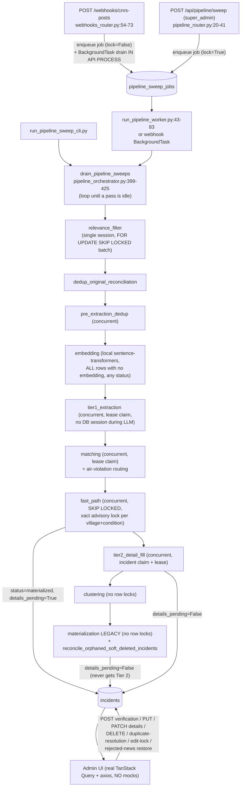

# Extraction → Action Flow Audit + LLM Knowledge Base Review

**Date:** 2026-09-24
**Scope:** read-only audit of `main` @ `ddc85b2` **plus the working-tree changes since committed as `4bb597f`** (notably `app/news/services/pipeline/pipeline_orchestrator.py`, which switches the manual-sweep advisory lock to a pinned AUTOCOMMIT connection). No code was run; no tests, migrations, or scripts were executed. Every claim below is from reading source.
**Method:** traced one `raw_messages` row from ingestion to every admin action, then mapped every LLM call site back to `app/core/llm_knowledge/`.

> On Windows `docs/` and `Docs/` are the same directory; this file lands in `Docs/audit-reports/`.

---

## 1. Executive summary (ranked by severity)

| # | Sev | Finding | Link |
|---|-----|---------|------|
| 1 | **Critical** | Tier 2 swallows every non-auth Ollama failure (e.g. a LAN outage), returns `{}`, then **finalizes** the incident (`details_pending=False`, `extraction_tier=2`, `status=materialized`). The category details are lost for good and nothing retries them. | [F1-01](#f1-01) |
| 2 | **Critical** | Tier 2 **re-stamps the bulletin-wide root toll onto every village row** of a multi-village message unless `casualty_scope` is exactly `bulletin_aggregate`. That undoes the null-per-village guard in materialization, including when the scope backstop *downgrades* an unsupported `bulletin_aggregate` to `unspecified`. | [F1-02](#f1-02) |
| 3 | **Critical** | The legacy `sweep_materialization` stage runs after fast-path in every sweep, locks no rows, and re-materializes any `parsed` row. It **bypasses fast-path's ambiguous-sub-event review hold**, the embedding wait, and story/revision routing. The incidents it creates have `details_pending=False`, so Tier 2 never runs on them. | [F1-03](#f1-03) |
| 4 | **Critical** | The incident edit form submits the **latest polled `version`** (5 s refetch) together with field values captured when the form opened. This defeats optimistic locking: pipeline merges made while an admin edits are silently overwritten. | [F1-04](#f1-04) |
| 5 | **Critical** | `PUT /incidents/{id}` sets **`source_link_2 = NULL` on every save** (the UI never sends it; the DTO defaults it to `None`). It also writes **no `incident_updates` row**. `DELETE` writes none either. | [F1-05](#f1-05) |
| 6 | **Critical** | Pipeline dedup, merge and revision candidate searches ignore `verification_status`. New reports get merged into **admin-rejected** incidents, which are hidden from the default list, and the new raw message is marked `duplicate`. Merges can flip `rejected → needs_verification`. Story revisions overwrite casualty counts on **human-verified** incidents while the "verified" status stays. | [F1-06](#f1-06) |
| 7 | **Critical** | A relevance-stage Ollama outage parks rows in `status=error`. `reset_retryable_extraction_errors` then re-queues them to `parsed`, **skipping relevance classification entirely**. Tier 1's own `is_relevant` is never read anywhere downstream. | [F1-07](#f1-07) |
| 8 | **Critical** | "Restore" of a `duplicate` raw message resets it to `parsed` but **does not undo the merge** already applied to the canonical incident, and writes no audit row. Rejecting one village row of a multi-village bulletin marks the **whole raw message** `rejected`. | [F1-08](#f1-08) |
| 9 | **High** | `rules/tier1_general_prompt.md`, the default Tier 1 prompt, contains **two divergent copies of itself**, a result of merge commit `ffa2576`. The first copy is cut off mid-schema, and several guardrails exist only in that truncated copy. Lines 3–4 have Arabic replaced by `?????`, and the Talloussa/Beit Yahoun fix example in `tier1_multi_village.md` is **mojibake**. | [F2-01](#f2-01) |
| 10 | **High** | Only 6 of the 10 stages in `index.yaml` are ever invoked. `casualty_merge.md`, `village_matching.md`, `story_revision_prompt.md`, `condition_action_reconciliation.md` and `tier1_core.md` **never reach any LLM**. Few-shot "retrieval" is always static first-k. | [F2-02](#f2-02) |
| 11 | **High (possibly Critical)** | No call sets `num_ctx`. The default Tier 1 system prompt is roughly 9–11k tokens on `qwen2.5:7b`. Unless the LAN Ollama server has a raised context length, **prompts are truncated silently**. This needs a runtime check. | [F2-03](#f2-03) |
| 12 | **High** | `reconcile_orphaned_soft_deleted_incidents` treats **admin deletes** as orphaned duplicates. Every materialization sweep links them as pending duplicates (score 0.0) of any active incident in the same village on the same date, whatever its condition. | [F1-09](#f1-09) |
| 13 | **High** | Fast-path commits one village at a time and marks the message `materialized` on the first insert. If a later village raises, the remaining villages are **never materialized**, because every claim excludes messages that already have an active incident. | [F1-10](#f1-10) |

---

## 2. Flow map (as found in code)

### Where reality differs from the REPO CONTEXT description

| Claim in brief | Reality (evidence) |
|---|---|
| Order `…→ embedding → clustering → materialization → duplicate_match_reconciliation` | The actual order is relevance → **dedup_original_reconciliation** → pre_dedup → **embedding (before tier1)** → tier1 → matching → fast_path → tier2 → clustering → materialization (`pipeline_orchestrator.py:229-343`). `duplicate_match_reconciliation` is **not a stage**. It is a side-call at the end of `sweep_materialization` (`pipeline_sweep_stages.py:698`). |
| Air-violation condition IDs 35/36/38/45 | The IDs are **{35, 36, 38}**. 45 is deliberately excluded (`app/news/constants/air_violation_conditions.py:1-9`). |
| raw_messages lifecycle `pending → (rejected\|duplicate\|parsed → … → routed_air_violation\|error)` | Additional terminal state `materialized` (`tier2_detail_fill_service.py:298`, `incident_materialization_service.py:902`). `error` is **not terminal**: `reset_retryable_*` moves `error → parsed` (`raw_message_repository.py:250`). An admin can move `materialized → rejected` via verification (`incident_repository.py:978`). |
| Human review is post-insert adjudication | True, but the pipeline **keeps rewriting adjudicated rows**: merges into rejected incidents, revisions over verified counts, and gate flags re-set over admin clears ([F1-06](#f1-06), [F1-14](#f1-14)). |
| "accept / reject / undo" admin actions | No accept endpoint exists. "Accept" = `POST /incidents/{id}/verification {status:"verified"}`. **There is no undo feature**. `UpdateAction.undo`, `.delete` and `.create` are declared (`incident_update.py:17-23`) but never written anywhere in `app/`. |
| Every incident change logged to `incident_updates` | False for PUT edit, delete, manual create, restore-from-rejected, and pipeline soft-deletes ([F1-05](#f1-05), [F1-11](#f1-11)). |
| Frontend is mock-first | **Not any more.** Nothing outside `frontend/src/mocks/` imports from `frontend/src/mocks/` (grep: 0 hits). Every incident/news action uses real axios calls in `features/news/api.ts`. The mocks folder is dead code. |
| LLM calls must not hold a DB session | True for Tier 1 and Tier 2 (`pipeline_llm_workers.py:42-63, 155-185`). **False for relevance_filter**: the batch is selected `FOR UPDATE SKIP LOCKED` on the sweep session and `classify_batch` is awaited on that same open session (`raw_message_repository.py:46-62`, `filter_relevance_action.py:69, 221`). |
| Gate-field convention enforced in service/UI | Enforced server-side on the **admin PATCH path only** (`incident_detail_edit_service.py:209-248`). Pipeline merges do not enforce it ([F1-14](#f1-14)). |
| DID fields only D / ID / null | Enforced by a DB enum (`incident_detail.py:15, 46-47`) and admin coercion (`incident_detail_edit_service.py:106-118`). This one holds. |

---

## 3. Findings — Part 1 (flow)

### F1-01 · Critical · Tier 2 finalizes incidents after an Ollama failure
**Where:** `app/llm/services/ollama_extraction_service.py:696-717` (per-category loop: logs and `continue`), `:758-770` (batched: logs and `return {}`); `app/news/services/extraction/tier2_detail_fill_service.py:124-139, 263, 295-301`.
**What's wrong:** every non-401 exception (connection refused, timeout, 502, malformed JSON) is swallowed inside `extract_tier2_details`. `apply_tier2_result_for_raw_message` receives `{}` or a partial dict, sets `extraction_tier=2`, sets `details_pending=False` on every incident of the message, and sets `raw_message.status=materialized`. The worker records this as a **success** (`pipeline_concurrent_sweeps.py:597`).
**Why it matters:** a LAN blip during Tier 2 permanently strips all category data (LA/UNIFIL/hospital/vehicle DIDs, names, category casualties) from every affected incident. The UI then shows it as complete, with no "Details pending" badge (`IncidentsPage.tsx:419`). Nothing can re-queue it.
**Direction:** distinguish "the LLM said nothing" from "the LLM call failed". On a transient failure, raise, keep `details_pending=True`, and add a Tier 2 retry counter or cap mirroring `record_transient_extraction_failure`.

### F1-02 · Critical · Multi-village root-toll stamping reintroduced in Tier 2
**Where:** `tier2_detail_fill_service.py:168-175, 234-257`. The guard it undoes is `incident_materialization_service.py:1728-1732`, whose comment says the fallback "would recreate the multi-village casualty misattribution bug". The downgrade path is `ollama_extraction_service.py:1516-1524`.
**What's wrong:** for a multi-village message, fast-path writes `deaths=None` for villages with no local count. Tier 2 then writes `incident.deaths = root.deaths` and `incident.total_deaths = compute_rollups(..., extraction.casualties)` for **each** incident whose value is `None` or `0`, unless `casualty_scope == bulletin_aggregate`. If the LLM returns `unspecified`, or the scope backstop downgrades an unsupported `bulletin_aggregate` to `unspecified`, every village gets the full bulletin toll. It also overwrites a legitimate `0`.
**Why it matters:** this is the bug class the project has fought hardest, and it is silently live again for every multi-village bulletin not classified as aggregate. Incidents are sometimes flagged `needs_verification` (lines 264-277), but the wrong numbers are persisted regardless and flow to the map and exports.
**Direction:** in Tier 2, never copy root counts when `is_multi_village`. Treat `None` as meaningful, as materialization already does. Add a regression test using an `unspecified` multi-village fixture. **No test currently covers this path** (`tests/test_tier2_detail_fill.py` has 5 tests, none multi-village).

### F1-03 · Critical · Legacy materialization bypasses fast-path's safety gates
**Where:** `pipeline_sweep_stages.py:638-685` (selects every `status=parsed AND match_result IS NOT NULL AND duplicate_of_id IS NULL` row, with no `FOR UPDATE`, no `fast_path_completed_at` filter, and no active-incident filter). `incident_materialization_service.py:1045-1430` (`materialize()`) has **no `_has_ambiguous_sub_event_scope` check, no story router, no `_fast_path_units` sub-event splitting, and no village advisory lock**. The hold in fast-path is `incident_materialization_service.py:336-348` plus `886-898` (it sets `needs_review` but **leaves `status=parsed`**). `incident.py:103-108` sets `details_pending` to default `False`.
**What's wrong:** when fast-path deliberately refuses to materialize an ambiguous multi-village sub-event message, the next stage in the **same sweep** materializes it anyway with root-level conditions. It likewise grabs rows fast-path is still holding for the embedding wait (`fast_path_embedding_wait_minutes=20`, `config.py:114`). Those rows are materialized with `khabar_embedding=None`, which skips dedup entirely (`:1205`), and without story-revision routing. Every incident it inserts has `details_pending=False`, so **Tier 2 never runs on it**.
**Why it matters:** the review gate for multi-action bulletins (the Talloussa/Beit Yahoun class) is illusory. Revision and toll-update bulletins that reach this path create new incidents instead of updating existing ones. Two processes (webhook drain with `lock=False` and the worker) can run this stage concurrently with no row locks.
**Direction:** either delete the legacy stage (fast-path + Tier 2 cover the path) or make it claim through `PipelineClaimRepository` with the same eligibility clause as fast-path. Make the ambiguous-scope hold terminal, e.g. with a dedicated status. `claim_pending_legacy_materialization` (`pipeline_claim_repository.py:167-187`) already exists and is unused.

### F1-04 · Critical · Frontend defeats optimistic locking
**Where:** `frontend/src/features/news/hooks.ts:135-142` (detail query `refetchInterval: 5_000`, `refetchIntervalInBackground: true`). `frontend/src/features/news/pages/IncidentDetailPage.tsx:784-796` (PUT sends `version: incident.version`, read from the *latest* poll, while the form uses uncontrolled `defaultValue`s captured at open, `:809-819`). `:745` does the same for section PATCH, and `:852` and `:889` for delete and duplicate resolution.
**What's wrong:** the backend check `Incident.version == payload.version` (`incident_repository.py:758, 806`) is correct. But the client re-reads `version` every 5 s. If a pipeline merge or story revision bumps the version while the admin is editing (the pipeline ignores the edit lock), the next save carries the new version and overwrites the merged values with the stale form contents.
**Why it matters:** last-write-wins between admin and pipeline, with no error shown, even though the server-side design is correct.
**Direction:** snapshot `version` when the editor opens (store it next to the form state) and submit that. Pause detail polling while an editor or dialog is open.

### F1-05 · Critical · PUT wipes `source_link_2` and writes no audit row; DELETE writes no audit row
**Where:** `app/news/dtos/incident_dto.py:212-224` (`source_link_2: str | None = None`). `app/news/repositories/incident_repository.py:782-791` (`setattr` for **every** DTO field, then commit, with **no `IncidentUpdate` row**). `IncidentDetailPage.tsx:784-796` (no `source_link_2` field sent; `grep source_link_2 frontend/src` finds it only in `types.ts` and the dead mock). Delete is at `incident_repository.py:859-884`: `is_deleted=True`, no log.
**What's wrong:** every UI "Update" nulls `source_link_2`. That link is populated by duplicate merges (`incident_repository.py:1119-1120`) and workbook import. Edits to khabar, casualty counts and date are unlogged, and so are deletes. `incident_updates` therefore cannot reconstruct who changed casualties or who deleted what.
**Why it matters:** silent data loss on every edit, and the audit trail the brief treats as an invariant does not exist for the two most common destructive actions.
**Direction:** make PUT a partial update (`exclude_unset`) or add `source_link_2` to the form. Write an `IncidentUpdate(action=edit)` with a field diff in `update()`, and `IncidentUpdate(action=delete)` in `delete()`.

### F1-06 · Critical · Pipeline writes over human decisions
**Where:**
- Candidate queries filter only `is_deleted` and never `verification_status`: `find_fast_dedup_candidates` (`incident_repository.py:1644`, filters near `:1686-1694`), `find_story_candidates` (`:1824`, filters near `:1878-1882`). `find_best_match` behaves the same way through `list_duplicate_candidates` (`:1206`).
- The default list hides rejected incidents: `incident_repository.py:2207-2208`.
- `merge_existing` sets `verification_status="needs_verification"` on a conflict **whatever the current status**, including `rejected` (`:1424-1434`). Otherwise it downgrades `needs_verification → auto_processed` (`:1439-1446`).
- `materialize()` does the same to `existing` (`incident_materialization_service.py:1221-1231`).
- `apply_story_revision` overwrites `deaths/injuries/total_*` unconditionally (`incident_repository.py:1537-1540`) and leaves `verified_by_user_id` and `verified_at` untouched.

**What's wrong / why it matters:**
- (a) A genuine new report matching an incident an admin **rejected** is merged into the hidden rejected row, and its raw message becomes `duplicate` (`incident_materialization_service.py:700-711`). The event disappears from the dashboard.
- (b) A conflict merge silently **un-rejects** an incident (`rejected → needs_verification`).
- (c) A "verified" incident can show machine-rewritten casualty numbers under a human-verified badge.

**Direction:** exclude `rejected` incidents from all candidate searches, or route matches against them to a pending review. On any automated write to a `verified` incident, demote it to `needs_verification` with a reason. Never write the `rejected` status from the pipeline.

### F1-07 · Critical · Relevance gate bypass after an Ollama outage; Tier 1 `is_relevant` ignored
**Where:** `filter_relevance_action.py:249-270` (after a retry failure, `save_error` sets `status=error`, keeps `filter_result=NULL` and stores a message like `ConnectError: …`). `raw_message_repository.py:202-258`: `reset_retryable_extraction_errors` selects `status=error AND extraction_result IS NULL AND error_message ILIKE transient`, which also matches **relevance errors**, and sets `status=parsed` (`:250`). The reset runs before every Tier 1 sweep (`pipeline_concurrent_sweeps.py:350-353`). `grep -rn is_relevant app/` finds only the DTO, the schema and the CNRS fallback. **Nothing in matching or materialization reads it** (`match_incident_action.py:22-69`).
**What's wrong:** messages the relevance filter never classified go straight to extraction and incident creation. Their `extraction_retry_count` stays 0, so the retry cap never applies. Separately, when Tier 1 says `is_relevant=false` but still fills `village`/`action_description` (small models often do), the incident is materialized anyway.
**Why it matters:** the UNIFIL, Palestine-route, civilian-fire and Gaza exclusions in the prompts are only as strong as the model's willingness to also null every other field.
**Direction:** scope the reset query to rows where `filter_result IS NOT NULL`, or record the failing stage on the row. Treat `is_relevant=false` as a terminal reject, or at least a review flag, in `MatchIncidentAction`.

### F1-08 · Critical · "Restore" and "reject" do not do what they appear to do
**Where:** `app/api/rejected_news_router.py:283-344`; `incident_repository.py:961-979`.
**What's wrong:**
- (a) For a raw message that fast-path merged as `duplicate`, restore sets `status=parsed` and `duplicate_of_id=None`. The canonical incident **keeps the merged casualties, details and `merged_from` provenance**. The confirmed `duplicate_matches` row stays `confirmed_duplicate`. Reprocessing will usually merge it again, so the restore is often a no-op that looks like it worked.
- (b) Rejecting **one** village incident sets the **whole** raw message to `status=rejected` with `filter_result.verdict=reject`, while sibling village incidents stay active. The message then appears on the Rejected News page. Restoring it un-rejects **all** rejected siblings, including ones rejected separately for other reasons (`:305-321`).
- (c) Restore writes no `incident_updates` row and no audit-log row. It takes no edit lock and checks no version.
- (d) Accepting an incident after rejecting it (`verified`) does not restore `raw_message.status`, which stays `rejected`.

**Direction:** make reject per-incident and set raw status only when no active non-rejected incidents remain. Make restore of a merged duplicate either unsupported, with a clear message, or a real un-merge driven by the `pipeline_merge` snapshot in `incident_updates`. Log both actions.

### F1-09 · High · Admin deletes relabelled as pending duplicates every sweep
**Where:** `app/news/services/dedup/duplicate_match_reconciliation.py:53-126` (called at `pipeline_sweep_stages.py:698`). The orphan query at `:60-67` selects every `is_deleted=True` incident that has no `duplicate_matches` row. `_find_representative_incident` falls back to **any** active incident in the same village on the same date, of any condition (`:30-44`). The link is written as `status=pending, similarity_score=0.0` (`:108-112`).
**Why it matters:** a manual delete, which has no audit row ([F1-05](#f1-05)), acquires a fabricated "possible duplicate of X" record. The orphan scan is also an unbounded full-table read on every sweep for deletes with no representative.
**Direction:** only reconcile incidents soft-deleted by pipeline paths, marked with a delete-reason column or an `incident_updates(action=delete)` row.

### F1-10 · High · Partial multi-village fast-path failure strands the remaining villages
**Where:** `incident_materialization_service.py:1018-1020` (`_mark_materialized` plus commit per village insert). `pipeline_claim_repository.py:129-152` (`~has_active_incident`). `pipeline_concurrent_sweeps.py:518-525` (the exception is logged and the row is left as is).
**What's wrong:** village 1 commits and marks the message `materialized`. If village 2 raises (story router, merge, or a non-hash `IntegrityError`), no claim will ever pick the message up again: status is no longer `parsed`, and it has an active incident.
**Direction:** give the message one transaction for all villages, or mark it materialized only after the loop and let the claim tolerate partial state.

### F1-11 · High · Audit log gaps and write-only log
**Where:** `IncidentUpdate` writers: `incident_repository.py:845` (PATCH details), `:983` and `:1182` (status changes), the pipeline merge and revision paths, `tier2_detail_fill_service.py:365`, and `incident_materialization_service.py:1771-1803`. **Unlogged:** PUT (`:750-792`), delete (`:859-884`), manual create (`:697-748`), restore (`rejected_news_router.py:283-344`), clustering and Tier 2 canonicalize soft-deletes (`incident_repository.py:2018-2107`). **Readers:** `_toll_revisions_for` (`:590-636`, which renders toll history), plus idempotency lookups (`:1378`, `:1601`, `tier2_detail_fill_service.py:354`) and `bulletin_reconciliation_service.py:197`. So the log is not write-only, but no undo exists and the `create`, `delete` and `undo` enum values are never written.
**Direction:** a single `record_incident_change()` helper called from every mutation path.

### F1-12 · High · Story revision heuristic can regress casualty counts
**Where:** `app/news/services/dedup/story_relationship_service.py:34-36` (`llm_classify` defaults to `None` and **no caller passes one**: `story_continuation_router.py:33` is the only constructor). `:178` classifies any "sparse" message with embedding similarity ≥ **0.40** as a `revision`. `incident_repository.py:1537-1540` then overwrites the counts.
**What's wrong:** a late-arriving sparse preliminary bulletin ("2 injured") that follows a fuller report ("5 injured") is classified as a revision and **lowers** the stored count. There is no monotonicity guard and no check that the revision is newer. The LLM revision prompt exists (`rules/story_revision_prompt.md`) but is never wired ([F2-02](#f2-02)).
**Direction:** compare `message_datetime` against the candidate's latest `merged_from` and never decrease counts on a heuristic-only revision without flagging it for review.

### F1-13 · High · Multi-village air violations keep only the first village
**Where:** `app/news/repositories/air_violation_repository.py:570-580`. Routing keys on the root `matched_condition_id` and takes `next(...)` over the first matched village.
**Why it matters:** "warplanes over X, Y and Z" produces one `air_violations` row at X.
**Direction:** route per village match, as incidents do.

### F1-14 · High · Gate and presence flags re-set by pipeline merges over admin clears
**Where:** `app/news/services/incident_details/incident_detail_merge.py:21-26` (`_merge_bool_flag`: `True` always wins), `:29-47` (no gate/DID validation). This is used by `merge_existing` (`incident_repository.py:1480`), `apply_story_revision` (`:1566`) and admin duplicate confirmation (`:1136-1143`). Compare the admin path, `incident_detail_edit_service.py:209-248`, which validates.
**What's wrong:** if an admin clears `la=False` because the army was only an escort, the next merged report with `la=True` re-sets it, and `merge_existing` sets `details_pending=True` (`:1478-1479`). The gate rule is enforced only on the admin PATCH path. There is no DB constraint.
**Direction:** record admin-cleared gates, e.g. with a provenance column or the `incident_updates` history, and have merges respect them. Run `_validate_gate_and_did_rules` after pipeline merges.

### F1-15 · Medium · Relevance filter holds a session and row locks during the LLM call, and locks leak mid-batch
**Where:** `raw_message_repository.py:46-62` (batch `FOR UPDATE SKIP LOCKED`), `filter_relevance_action.py:69-221`. Every `save_filter_result` commits (`raw_message_repository.py:98`), which releases **all** of the batch's row locks. The remaining candidates are then unlocked while `classify_batch` runs, so a concurrent sweep (the webhook drain uses `lock=False`) can classify them twice.
**Direction:** use the lease-claim pattern from Tier 1: claim ids, commit, close the session, call the LLM, then write.

### F1-16 · Medium · `merge_existing` re-runs Tier 2 against the wrong message
**Where:** `incident_repository.py:1478-1479` sets `existing.details_pending=True` when a merged report introduces new categories. The Tier 2 claim then processes `incident.raw_message_id`, the **original** message (`pipeline_claim_repository.py:189-208`, `pipeline_llm_workers.py:161-185`). That extraction is usually already at tier 2, so `tier2_categories=None`: the new categories never get detail extraction, but verification and dedup side effects re-run. Incidents with `raw_message_id IS NULL` (manual or imported) that get flipped to `details_pending` are never claimed (inner join), so they show "Details pending" forever.

### F1-17 · Medium · Pipeline ignores the admin edit lock
**Where:** no pipeline path checks `locked_by_user_id`. Combined with `version_id_col` (`incident.py:128-133`), the admin gets a 409 after the pipeline writes (good, not last-write-wins), except where [F1-04](#f1-04) defeats it.
**Direction:** fix F1-04 first. Optionally defer pipeline merges to locked incidents.

### F1-18 · Medium · Authorization inconsistencies
**Where:** `deps.py:32-45`. `POST /news/import-khabar` is `require_admin` (`news_router.py:221-226`) while its sibling imports are `require_super_admin` (`news_router.py:204-208`, `incidents_router.py:127-132`). `POST /accounts/bootstrap` is unauthenticated (`accounts_router.py:46-59`). It relies on `bootstrap_super_admin_action` refusing once a super_admin exists; not re-verified here. Source pause/resume and content-source blocking are admin-level (`sources_router.py:66-83`, `content_sources_router.py:33-43`). The audit and login logs are readable by admins (`logs_router.py:17-32`). Every route checks roles server-side, and none relies on the frontend alone. Whether the admin-level exceptions are intended needs a decision from Hussein.

### F1-19 · Low · Live stream inflates list totals
**Where:** `frontend/src/features/news/hooks.ts:93-98`. `total + 1` is applied even when the streamed incident does not match the active filters. Also, the stream only emits on **insert** (`incident_materialization_service.py:223-237`). Merges and revisions reach the list only through polling.

### Part 1 §3 edge-case table

| Edge case | Handled? | Evidence |
|---|---|---|
| Multi-village across **every stage** | **No** | Fast-path handles it (`_fast_path_units`, null-per-village guard `:1728-1732`). Tier 2 re-stamps the root toll ([F1-02](#f1-02)). Legacy materialize ignores sub-events ([F1-03](#f1-03)). Air violations keep the first village ([F1-13](#f1-13)). Partial failure strands villages ([F1-10](#f1-10)). Reject escalates to the whole message ([F1-08](#f1-08)). |
| Multi-village across **dashboard actions** | **Partly** | Actions are per-incident, but reject and restore act on the raw message ([F1-08](#f1-08)). Admin duplicate confirmation requires the same village (`incident_repository.py:1102-1106`). |
| Toll revision preserves admin decisions | **No** | `apply_story_revision` overwrites counts on verified incidents without demoting them. Candidates include rejected incidents ([F1-06](#f1-06)). The heuristic can lower counts ([F1-12](#f1-12)). |
| Duplicate/merge between two admin-decided incidents | **No** | Automated canonicalize (`tier2_detail_fill_service.py:427-452` → `incident_merge_service.py:35-59`) soft-deletes the "duplicate" without checking its `verification_status` or lock. Clustering soft-deletes members the same way (`pipeline_sweep_stages.py:577-605`). Admin `resolve_duplicate` does not redirect **other** pending matches pointing at the retired incident (`incident_repository.py:1160-1171`; `redirect_pending_duplicate_matches` is not called there, and only the next sweep's reconciliation patches it up). |
| `matched_low_confidence` / `needs_review` / `needs_verification` surfaced | **Mostly yes** | Incident-level: `verification_reason` in the list (`IncidentsPage.tsx:463`), `VillageMatchNotice` (`IncidentDetailPage.tsx:398-399`), and the "Details pending" badge (`IncidentsPage.tsx:419`). **Not surfaced:** raw-message-level `filter_result.needs_review` from the fast-path ambiguous-scope hold (`incident_materialization_service.py:886-898`). That row has no incident, and legacy materialize overrides the hold anyway ([F1-03](#f1-03)). |
| Tier 2 fails after fast-path created the incident | **No (silent)** | [F1-01](#f1-01). The incident is visible while `details_pending=True` (badge shown). After a failure it is finalized as complete. |
| Ollama (LAN) down | **Mixed** | 401 aborts the sweep cleanly (`pipeline_orchestrator.py:241-249, 289-297, 319-327`). Tier 1 transient errors retry up to `extraction_max_retries=5`, then park in `error` (`raw_message_repository.py:164-200`). Relevance: gate bypass ([F1-07](#f1-07)). Tier 2: silent data loss ([F1-01](#f1-01)). Admin actions do not depend on Ollama. |
| CNRS down | **Not verifiable** | Ingestion is push-only (webhook). There is no pull, so nothing is "in flight" on the platform side. Whether CNRS retries undelivered webhooks is outside this repo. |
| Admin vs concurrent pipeline write | **Server yes, client no** | `version_id_col` plus the version check is correct server-side. The client submits the polled version ([F1-04](#f1-04)). |
| super_admin vs admin enforced server-side | **Yes** (with inconsistencies) | Every router uses `Depends(require_*)`. See [F1-18](#f1-18). |
| Gate-field rule enforced | **Admin path only** | `incident_detail_edit_service.py:209-248`. Not in pipeline merges and not in the DB ([F1-14](#f1-14)). DID values are DB-enum enforced. |
| Two workers on the same raw row | **Mostly prevented** | Tier 1, matching and Tier 2 use lease plus `SKIP LOCKED` (`pipeline_claim_repository.py:21-33, 94-125, 189-208`). Fast-path uses `SKIP LOCKED` plus a transaction-scoped advisory lock per village and condition (`pipeline_advisory_lock.py:15-29`). **Not prevented:** legacy materialization, clustering and embedding (no locks), and relevance after the first commit ([F1-15](#f1-15)). |

---

## 4. Findings — Part 2 (LLM knowledge base)

### 4.1 Inventory (content-based)

Token counts are approximate: about 4 characters per token for English and about 2.5 for Arabic on qwen2.5.

| File | Lines | Chars | ~Tokens | What it actually does |
|---|---|---|---|---|
| `rules/tier1_general_prompt.md` | 202 | 23,251 | ~8–9k | **Default** Tier 1 general-fields prompt (Arabic). It contains **two divergent copies** plus garbled lines 3–4 and an English trailer at line 202. |
| `rules/combined_tier1_prompt.md` | 122 | 13,107 | ~3.5k | Presence plus general fields in one call. Its intro is duplicated (lines 1–12 repeated at 15–27). **Disabled by default** (`config.py:47`). |
| `rules/tier1_multi_village.md` | 68 | 6,747 | ~2k | Situational multi-village, route and fuzzy-area rules. Lines 46 and 50 contain mojibake. |
| `rules/presence_gate_prompt.md` | 69 | 6,316 | ~1.6k | Category presence gate (subject/target test). |
| `rules/tier2_category_detail_prompt.md` | 81 | 6,114 | ~1.6k | Per-category DID/name/casualty extraction (default Tier 2). |
| `rules/tier2_batched_category_detail_prompt.md` | 62 | 3,582 | ~0.9k | Batched Tier 2. Refers to "the single-category prompt", which the model never sees (`:9, :22, :54`). Disabled by default (`config.py:49`). |
| `rules/relevance_filter_prompt.md` | 51 | 3,484 | ~0.9k | Batch relevance verdicts plus the geographic scope gate. |
| `rules/tier1_core.md` | 49 | 2,929 | ~0.8k | Older English condensed Tier 1 rules. **Not in `index.yaml`, never loaded.** |
| `rules/village_matching.md` | 39 | 2,334 | ~0.6k | Documents the *code* matching thresholds and aliases. Matching is not an LLM call. |
| `rules/casualty_merge.md` | 37 | 1,795 | ~0.5k | Documents the scope values and transition-merge algorithm. Only indexed under unused stages. |
| `rules/story_revision_prompt.md` | 34 | 1,368 | ~0.4k | Revision classifier prompt. **Stage never invoked.** |
| `rules/condition_action_reconciliation.md` | 18 | 864 | ~0.25k | Text-over-CNRS-subtype precedence. **Not in `index.yaml`.** |
| `terminology/casualty_gender.yaml` | 377 | 8,743 | matched subset only | Gender, status and role term catalogue. Also used by code backstops. |
| `terminology/condition_labels.yaml` | 318 | 9,104 | matched subset | Condition alias phrases used by `condition_aliases.py`, plus prompt glossary entries. |
| `terminology/role_terms.yaml` | 412 | 8,101 | matched subset | Presence, proximity and vehicle term lists. Code plus prompt. |
| `terminology/village_aliases.yaml` | 266 | 8,814 | — | Village alias source of truth, used by `village_aliases.py`. Only an unused stage lists it for prompts. |
| `terminology/org_types.yaml` | 124 | 3,993 | matched subset | Emergency and health organization names. |
| `terminology/revision_language_markers.yaml` | 130 | 3,570 | matched subset | Revision and transition markers. The term `ارتفاع عدد الشهداء/الجرحى` (with a literal slash) can never match source text. |
| `terminology/village_match_exceptions.yaml` | 2 | 168 | — | **Empty.** Comments only, after the `بيوت السياد` entry was removed on 09-23. |
| `terminology/condition_match_exceptions.yaml` | 7 | 501 | — | One entry: Abbasiyeh car fire → needs_review. |
| `fewshot/scope_examples.jsonl` | 10 | 2,086 | ~0.3k (k=3) | Transitions, scope and demographics examples. |
| `fewshot/village_collision_examples.jsonl` | 4 | 1,151 | ~0.4k (k=3) | Route, origin/target and sub-event examples, plus one non-extraction "village_match_note" example. |
| `eval/corpus/*.jsonl` (5 files) | 35 rows | — | — | Offline harness corpus (`eval/run_eval.py`). `relevance_filter.jsonl` starts with a UTF-8 BOM. |
| `index.yaml`, `loader.py`, `prompt_assembly.py` | 101 / 362 / 26 | — | — | Stage → files map, builder, assembly. |
| `CHANGELOG.md` | 349 | 24,232 | — | Policy plus fix log. |

### 4.2 Call-site map

| Stage | Call site | Rule files loaded | Approx system-prompt tokens |
|---|---|---|---|
| relevance_filter | `local_llm_relevance_classifier.py:108` | `relevance_filter_prompt.md` | ~0.9k (+ batch of posts) |
| tier1 (default) — presence | `ollama_presence_gate_service.py:149` | `presence_gate_prompt.md` + matched `org_types`, `role_terms` | ~1.7k |
| tier1 (default) — general | `ollama_extraction_service.py:905` | `tier1_general_prompt.md` (+ `tier1_multi_village.md` if the regex trigger fires) + matched `role_terms`, `revision_language_markers`, `casualty_gender`, `condition_labels` + first 3 of `village_collision_examples` | **~9k, or ~11k with multi-village** |
| tier1 (combined, off) | `ollama_extraction_service.py:453` | `combined_tier1_prompt.md` (+ multi-village) + matched terms + first 3 of `scope_examples` | ~4–6k |
| tier2 (default) | `ollama_category_detail_service.py:190` | `tier2_category_detail_prompt.md` + matched `org_types`, `role_terms`, `casualty_gender` | ~1.7k × **one call per category** |
| tier2 (batched, off) | `ollama_category_detail_service.py:224` | `tier2_batched_category_detail_prompt.md` + matched terms | ~1k |
| matching | — | **no LLM call** (trigram, aliases, geo; `matching_service.py`) | — |
| story revision / merge | — | **no LLM call** (`story_relationship_service.py:34-36`, `llm_classify=None`) | — |
| casualty_scope / casualty_transitions / village_matching / story_revision stages | — | indexed in `index.yaml:34-78` but **never passed to `build_stage_system_prompt`** | — |

### 4.3 Bug-category coverage

| Bug category | Where an LLM-readable rule exists | Loaded where the bug happens? | Code-only guard |
|---|---|---|---|
| Multi-village casualty misattribution | `tier1_general_prompt.md:28-29, 75-77` (and duplicates), `tier1_multi_village.md:20-23`, `combined_tier1_prompt.md:68-73` | Tier 1: yes. **Tier 2: no.** The Tier 2 prompts have no village scoping, and the bug is reintroduced in Tier 2 *code* ([F1-02](#f1-02)). | `casualty_scope_backstop.py`, `_root_casualties_for_village`, `suppress_category_casualties` |
| Village name collision (Zebdine/Zibdine) | `village_matching.md` only | **Never loaded.** Matching is not an LLM call, so the file is documentation. | Geo-context disambiguation (`matching_service.py:181-209`), aliases and exceptions. No `زبدين`/Zebdine eval row exists; the route example uses `زبدين` only for splitting. |
| Story continuation / toll revision | `story_revision_prompt.md`; markers in `revision_language_markers.yaml` | **Prompt never loaded.** The markers are appended to Tier 1 only as a glossary. | `story_revision_backstop.py` plus the heuristic ([F1-12](#f1-12)). **Code-only in practice.** |
| Arabic gender (شهيد مسعف) | `casualty_gender.yaml:175-178` (matched-terms glossary). Examples in `scope_examples.jsonl:1` and in the prompt example (`tier1_general_prompt.md:39, 135` shows `male_deaths:1`) | Tier 1: glossary yes. Tier 2: glossary yes. | `casualty_gender_evidence.py` (`apply_casualty_gender_backstops`, `pipeline_llm_workers.py:70`) |
| Missing village aliases splitting events | `village_aliases.yaml` + `village_matching.md` | Only via the unused `village_matching` stage. Used by **code** (`village_aliases.py`). | Code-only. That is appropriate, since matching isn't LLM-driven. |
| Casualty double-counting on injured→died | `tier1_general_prompt.md:41-52` (and copy), `combined_tier1_prompt.md:74-77`, `casualty_merge.md:23-37` | The Tier 1 extraction side is loaded. `casualty_merge.md` is **not loaded anywhere**. | `casualty_transition_backstop.py`, `merge_existing` idempotency (`incident_repository.py:1375-1400`). **But** admin `resolve_duplicate` uses blind max-wins (`:1109-1116`) with no transition logic. |

### 4.4 Structural problems

**F2-01 · High · Corrupted and duplicated default Tier 1 prompt.**
- `tier1_general_prompt.md` contains the full prompt twice. Copy 1 (lines 5–99) stops mid-schema at `"casualty_scope": "unspecified",` (line 99). Copy 2 restarts at line 100. `git log` shows the duplication entering with merge commit `ffa2576` (2026-09-23): 39f79d5 already had 2 copies on the other branch.
- The copies **diverge**. The fuzzy-area rule (`في محيط X وY`, line 25), the effect-attribution rule (line 32) and the Majdal Zoun negative example (line 63) exist **only in the truncated copy 1**. The CNRS fire rule (line 126) exists only in copy 2. The model sees the fuzzy-area guardrail followed by a later "complete" version that omits it.
- Lines 3–4 contain `"?? ?????? ?????? ?????"` where the Arabic for "من فلسطين باتجاه لبنان" and the sector names should be, introduced in `109a2f7` (2026-09-17).
- `tier1_multi_village.md:46, 50` contain `تمشيط` (double-encoded UTF-8) in the Talloussa/Beit Yahoun example: the logged 09-24 fix itself (`4edc7f0`).
- `combined_tier1_prompt.md:15-27` repeats lines 1–12.
- `combined_tier1_prompt.md:60` says "See `rules/tier1_multi_village.md`": the model cannot open files, and that file is only appended when the regex trigger fires.

**Direction:** regenerate the file from one clean copy, and add a unit test that fails on `?{3,}`, `Ã|Ø[\x80-\xBF]` and duplicate headings in any rule file.

**F2-02 · High · Dead stages and rule files; static few-shot.**
- Runtime calls exist only for `relevance_filter`, `tier1_extraction`, `combined_tier1`, `presence_gate`, `tier2_detail` and `tier2_detail_batched` (grep of `build_stage_system_prompt`). `casualty_scope`, `casualty_transitions`, `village_matching` and `story_revision` (`index.yaml:34-78`) are never built. `tier1_core.md` and `condition_action_reconciliation.md` are not in the index at all.
- `get_prompt_builder()` is called with no embedding service (`prompt_assembly.py:21`, `loader.py:321-325`), so `_retrieve_fewshot` always returns `pool[:k]` (`loader.py:296-297`). Tier 1 always gets the same 3 examples: dash-route, origin/target, and two-sub-event.
- Few-shot `sub_events` examples use the key `action_description` (`scope_examples.jsonl:1`, `village_collision_examples.jsonl:3`), but the prompts' schema requires `action_text` (`tier1_general_prompt.md:36-39`, `tier1_multi_village.md:25`). The examples contradict the schema.
- The few-shot example `{"input":"النبطية","expected":{"village_match_note":…}}` (`village_collision_examples.jsonl:4`) is not an extraction example at all, but can still be served to Tier 1.

**F2-03 · High (runtime check needed) · Context window.** `OllamaChatClient.chat` sends only `{"temperature": …}` as options (`app/core/ollama_client.py:60-70`). `num_ctx` appears nowhere in the repo, docker files or compose files. The default Tier 1 general system prompt is about 9k tokens, about 11k with the multi-village rule, before the user post. If the Ollama server's context length is below that, Ollama truncates, dropping the oldest tokens (the start of the system prompt). The LAN server config is not visible from the repo.

**F2-04 · Medium · Overbroad loading.**
- `condition_labels.yaml` (318 lines) is scanned into Tier 1 general, which is told *not* to classify conditions.
- The Tier 1 general prompt carries the complete casualty-transition and scope doctrine on every first report.
- Tier 2 makes **one call per present category**, each re-sending about 1.7k tokens (`ollama_extraction_service.py:689-727`).

**F2-05 · Medium · Contradictions.**
- `village_matching.jsonl` row 6 expects `وادي السلوقي` → `match: null (ambiguous)`, and row 7 expects `وادي الحجير` → null. The 09-23 changelog (lines 100, 118-127) and the last row of the same file resolve Selouqi to Touline 73282 and add `محمية وادي الحجير` as an alias. The eval corpus contradicts itself.
- `combined_tier1_prompt.md:84-86` gives English village values in examples, while `tier1_general_prompt.md:16` requires Arabic-only values. This is a minor inconsistency between two prompts for the same job.

**F2-06 · Medium · Tier 2 prompts assume context they don't get.** The batched prompt defers to "the single-category prompt" (`tier2_batched_category_detail_prompt.md:9, 22, 54`). Neither Tier 2 prompt receives the Tier 1 village list or scope, so multi-village category casualties cannot be scoped by the LLM. The only protection is the code-side suppression (`tier1_multi_village.md:66-68` documents this).

### 4.5 CHANGELOG cross-check

| Entry | Rule still present? | Loaded at the intended call site? | Test exists? | Verdict |
|---|---|---|---|---|
| 09-24 Condition/action reconciliation | `condition_action_reconciliation.md` yes | **No.** Not in `index.yaml` | yes (`test_condition_reconciliation.py`, `test_cnrs_extraction_fallback.py`) | **Rule dead; fix is code-only in practice** |
| 09-24 Flare bomb alias | `condition_labels.yaml` yes | Used by code (`condition_aliases.py`) | yes | OK |
| 09-24 Talloussa per-village actions | `tier1_multi_village.md` yes, **but the example is mojibake** | Yes, when the trigger fires | yes (3 tests, all with canned LLM output) | **Fix partially corrupted** |
| 09-24 CNRS fire action | copy 2 of `tier1_general_prompt.md:126` and `combined:50` | yes | yes | OK, apart from duplication |
| 09-23 No-ACS aliases | yes | code | yes | OK. The eval corpus contradicts it ([F2-05](#f2-05)). |
| 09-23 Gaza scope + Selouqi | `relevance_filter_prompt.md:17-21, 46-49` yes | yes | yes | OK |
| 09-21 Matching exceptions | `village_match_exceptions.yaml` is **empty** now (superseded 09-23) | code | **`test_village_exception_overrides_alias_and_similarity` no longer exists** (renamed or replaced by `test_confirmed_bouyout_sayyad_alias_overrides_similarity`, `tests/test_matching_service.py:271`) | **Stale entry** |
| 09-21 Fuzzy-area rule | Only in the **truncated copy 1** (`tier1_general_prompt.md:25, 63`). Copy 2 lacks it. | Degraded | yes | **Silently diluted by merge `ffa2576`** |
| 09-21 Burning Properties guard | yes (relevance, both Tier 1 prompts, `tier1_core.md`) | `tier1_core.md` is never loaded | code tests | Partly dead |
| 09-14 B.3 condition labels | yes | yes (tier1 terminology) | — | OK |

**Rule changes with no changelog entry:**
- `ddc85b2` (2026-09-24, changes 3 rule files)
- `109a2f7` (air-violation exclusions, the commit that introduced the `?????` lines)
- `3480afb` (large multi-village rewrite, 187 lines)
- `6b1a0fa`
- `c60f40e` (added `story_revision_prompt.md`)
- `4ce5cd2`
- `a4db207`

The CHANGELOG's own policy (lines 3–12) is violated.

### 4.6 Regression tests per rule file

`grep -rl <rulefile> tests/` finds **only `tier1_multi_village`** (in `tests/test_llm_knowledge_loader.py:72-79`, which asserts it gets loaded). The changelog-cited tests (`tests/test_extraction_service.py`, etc.) feed **canned model responses** through `_client_for_model_contents` (`tests/test_extraction_service.py:57-61`). They test post-processing, **not** the rule text. That is why the corruption in [F2-01](#f2-01) passed CI.

**Rule files with no traceable test of their content:** `tier1_general_prompt.md`, `combined_tier1_prompt.md`, `presence_gate_prompt.md`, `relevance_filter_prompt.md`, `tier2_category_detail_prompt.md`, `tier2_batched_category_detail_prompt.md`, `story_revision_prompt.md`, `casualty_merge.md`, `village_matching.md`, `condition_action_reconciliation.md`, `tier1_core.md`. The eval harness (`eval/run_eval.py`) exists but is manual and `--live`.

### 4.7 Per-file recommendation

| File | Verdict | Reason |
|---|---|---|
| `tier1_general_prompt.md` | **Needs revision (urgent)** | Duplicated, truncated, `?????` and divergent guardrails ([F2-01](#f2-01)); about 9k tokens against an unknown `num_ctx` ([F2-03](#f2-03)). |
| `combined_tier1_prompt.md` | Needs revision | Duplicated intro (15–27); a file reference the model can't follow (60); disabled by default. |
| `tier1_multi_village.md` | Needs revision | Mojibake in the key example (46, 50); schema key mismatch with few-shot. |
| `presence_gate_prompt.md` | Keep as-is | Coherent and loaded. Add a content test. |
| `relevance_filter_prompt.md` | Keep as-is | Coherent and loaded. Its protection is undermined by [F1-07](#f1-07), not by the text. |
| `tier2_category_detail_prompt.md` | Needs revision | No multi-village scoping; should receive the Tier 1 scope as context. |
| `tier2_batched_category_detail_prompt.md` | Needs revision | Refers to a prompt it doesn't include; off by default. |
| `story_revision_prompt.md` | Wire it or delete it | Never loaded ([F2-02](#f2-02)). Revision is heuristic-only ([F1-12](#f1-12)). |
| `casualty_merge.md` | Candidate for deletion (or move to `docs/`) | Describes code behavior; only listed under unused stages. |
| `village_matching.md` | Candidate for deletion (or move to `docs/`) | Documents code thresholds (accurate: `matching_service.py:41-47`). No LLM consumes it. |
| `condition_action_reconciliation.md` | Wire it into Tier 1, or move to `docs/` | Not indexed. |
| `tier1_core.md` | Candidate for deletion | Orphaned since Phase 3. Superseded by `tier1_general_prompt.md`. |
| `village_match_exceptions.yaml` | Candidate for deletion (or keep as an intentionally empty hook) | Empty; the code still loads it (`matching_service.py:139-144`). |
| `condition_match_exceptions.yaml` | Keep | Used by code, one real case. |
| other terminology YAMLs | Keep | Used by both code backstops and prompt glossaries. Fix the unmatchable slash term in `revision_language_markers.yaml`. |
| `fewshot/*.jsonl` | Needs revision | Keys `action_description` → `action_text`; remove the non-extraction example; retrieval is effectively static. |
| `eval/corpus/village_matching.jsonl` | Needs revision | Rows 6–7 contradict the 09-23 aliases. |
| `eval/corpus/relevance_filter.jsonl` | Needs revision | Starts with a BOM, which may break a `json.loads` per line (not run). |

---

## 5. Findings — Part 3 (code quality, files read only)

**F3-01 · Medium · Dead and duplicate modules.**
- `app/news/services/dedup_matching_service.py` (flat, 105 lines) is imported nowhere and has diverged from `app/news/services/dedup/dedup_matching_service.py`. `scripts/check_stale_service_imports.py:41` lists it as relocated, but only checks *imports*, so the orphan file survives.
- `app/news/services/matching/village_matching_service.py` is exported but never instantiated.
- `PipelineClaimRepository.claim_pending_legacy_materialization` (`pipeline_claim_repository.py:167-187`) is unused.
- The synchronous `sweep_extraction`, `sweep_matching` and `sweep_pre_extraction_dedup` (`pipeline_sweep_stages.py:156, 282, 344`) are used only by seeds and scripts, and near-duplicate the concurrent versions.
- `frontend/src/mocks/` is entirely unused.

**F3-02 · Medium · Misleading documentation in code.** `IncidentMergeService` claims to be "the single merge path" (`incident_merge_service.py:9-17`), but admin duplicate confirmation has its own merge logic (`incident_repository.py:1108-1143`) and `apply_story_revision` is a third path.

**F3-03 · Medium · Mis-scoped retry reset.** `reset_retryable_extraction_errors` identifies "extraction failures" by error-string pattern only (`raw_message_repository.py:214-231`) and catches other stages' errors ([F1-07](#f1-07)). Store the failing stage explicitly instead.

**F3-04 · Medium · Hard-coded defaults and seed behavior.**
- `auth_secret_key="development-only-change-me"` (`config.py:61`), `super_admin_seed_password="password"` (`:64`), and a LAN IP in `ollama_base_url` (`:31`). No startup guard refusing these in production was found.
- `seed_super_admin` **resets the super-admin password to the seed value on every run** (`app/core/seeds/seed_super_admin.py:70`).

**F3-05 · Low · `action_source` labelling.** `pipeline_llm_workers.py:81-87` labels any final action that differs from the CNRS hint as `llm_text`, even when it came from `apply_condition_evidence_override`. An LLM action that coincidentally equals the CNRS hint is labelled `cnrs_subtype_fallback`.

**F3-06 · Low · Redundant commits.** The `if holds_village_lock: self.db.commit()` blocks run after an unconditional commit (`incident_materialization_service.py:493, 501-502`).

**F3-07 · Low · Heavy import side effect.** `SentenceTransformer(...)` loads at module import (`clustering/embedding_service.py:7`) in every process that imports it, including the API.

**F3-08 · Low · Webhook drains the pipeline inside the API process.** `webhooks_router.py:70-72` uses a `BackgroundTasks` call to `drain_pipeline_sweeps_sync`, so LLM work runs in the API worker. It bypasses the dedicated worker's advisory-lock serialization (`use_advisory_lock=False`).

**F3-09 · Low · Advisory-lock reclaim may kill a legitimate CLI sweep.** On startup the worker terminates any lock holder whose `application_name` is not `war-news-pipeline` (`pipeline_advisory_lock.py:73-89, 92-136`). Whether the CLI sets that name was not verified.

**Missing tests for Part 1 edge cases** (grep of `tests/` found none):
- Tier 2 LLM failure → `details_pending` preserved ([F1-01](#f1-01))
- Tier 2 multi-village `unspecified` scope ([F1-02](#f1-02))
- Legacy materialize vs the ambiguous-scope hold ([F1-03](#f1-03); no test references `AMBIGUOUS_SUB_EVENT_SCOPE`)
- PUT preserving `source_link_2` or logging ([F1-05](#f1-05))
- Merge candidates excluding rejected incidents ([F1-06](#f1-06))
- Relevance errors not reset to `parsed` ([F1-07](#f1-07))
- Tier 1 `is_relevant=false` ([F1-07](#f1-07))
- Restore endpoint (no backend test; only `frontend/src/features/news/api.ts` references it)
- Frontend version handling ([F1-04](#f1-04))
- Sparse-revision count regression ([F1-12](#f1-12))
- Reconciliation of manual deletes ([F1-09](#f1-09))
- Rule-file encoding/duplication ([F2-01](#f2-01))

---

## 6. Unresolved questions (need a runtime check or a decision)

1. **Ollama context length** on `192.168.40.25:11435`. What are `OLLAMA_CONTEXT_LENGTH` and the per-model `num_ctx` for `qwen2.5:7b` and `gpt-oss:20b`? If either is below about 12k, [F2-03](#f2-03) becomes Critical. Check the Ollama logs for "truncating input prompt".
2. How often does Tier 2 hit transient errors in production? Query: incidents with `details_pending=false`, presence categories in `extraction_result.presence_category_keys`, and no matching category columns set.
3. How many rows went `error → parsed` with `filter_result IS NULL`? That count measures [F1-07](#f1-07) directly.
4. Does `bootstrap_super_admin_action` refuse once any super_admin exists? It is unauthenticated (`accounts_router.py:46-59`). Not read.
5. Intended roles: should admins import khabar, pause sources, block content sources, and read login and audit logs ([F1-18](#f1-18))?
6. Is legacy `sweep_materialization` still intended to run after fast-path, or is it a leftover? The answer decides the fix shape for [F1-03](#f1-03).
7. Should "restore duplicate" un-merge ([F1-08](#f1-08))? This is a product decision.
8. Does CNRS retry failed webhook deliveries? This is outside the repo.
9. Whether `eval/corpus/relevance_filter.jsonl`'s BOM breaks `run_eval.py` was not run.
10. The `pipeline_orchestrator.py` change to a pinned lock connection (now commit `4bb597f`) looks correct, but its tests (`tests/test_pipeline_orchestrator.py`) were not run.

---

## 7. Appendix — files read

**Pipeline:** `app/news/services/pipeline/{pipeline_orchestrator,pipeline_concurrent_sweeps,pipeline_llm_workers,pipeline_jobs,pipeline_advisory_lock}.py`, `pipeline_sweep_stages.py` (relevance, embedding, clustering, materialization sections), `app/news/repositories/pipeline_claim_repository.py`, `app/core/scripts/run_pipeline_worker.py`, `app/api/{pipeline_router,webhooks_router}.py`.

**LLM:** `app/llm/actions/filter_relevance_action.py`, `app/llm/services/ollama_extraction_service.py` (lines 400–1039, 1496–1524), `app/llm/services/transient_llm_errors.py`, `app/core/ollama_client.py` (grep), `app/core/config.py` (grep).

**Materialization and dedup:** `app/news/services/materialization/incident_materialization_service.py` (258–1444, 1653–1742), `app/news/services/extraction/tier2_detail_fill_service.py`, `app/news/services/incident_details/casualty_scope_backstop.py`, `app/news/services/dedup/{fast_path_eligibility,story_continuation_router,incident_merge_service,duplicate_match_reconciliation}.py`, `story_relationship_service.py` (30–226), `dedup_matching_service.py` (outline and diff), `app/news/actions/match_incident_action.py`, `app/news/repositories/air_violation_repository.py` (570–600), `app/news/constants/air_violation_conditions.py`, `app/news/services/clustering/embedding_service.py`.

**Admin and API:** `app/api/deps.py`, `app/api/incidents_router.py`, `app/api/rejected_news_router.py` (197–344), `app/api/accounts_router.py` (36–62), route/auth grep of all routers, `app/news/services/incidents/incident_service.py`, `app/news/repositories/incident_repository.py` (697–1216, 1293–1627, 1644–1700, 1824–1930, 2018–2162), `app/news/repositories/raw_message_repository.py` (46–315), `app/news/models/{incident,incident_update}.py` (partial), `app/news/models/incident_detail.py` (grep), `app/news/dtos/incident_dto.py` (212–304), `app/news/services/incident_details/{incident_detail_merge,incident_detail_edit_service}.py` (merge full; edit outline), `category_mapper.py` (79–93, 572), `app/core/seeds/seed_super_admin.py` (55–78).

**Frontend:** `frontend/src/features/news/{hooks,api}.ts`, `pages/IncidentDetailPage.tsx` (86–195, 700–910), `pages/RejectedNewsPage.tsx` (40–75), `pages/IncidentsPage.tsx` (410–425, grep), mocks import grep.

**Knowledge base:** every file under `app/core/llm_knowledge/` (all rules, all fewshot, all eval corpus heads, all terminology heads, `index.yaml`, `loader.py`, `prompt_assembly.py`, `__init__.py`, `CHANGELOG.md`).

**Tests (grep and name checks):** `tests/test_{extraction_service,matching_service,tier2_detail_fill,extraction_retry_cap,llm_knowledge_loader,…}.py`. **Scripts:** `scripts/check_stale_service_imports.py` (1–60).

**Git:** `git diff --stat`, the `app/core/llm_knowledge/rules` log, `git show --stat` for 9 commits, and pickaxe searches for the corrupted strings.
