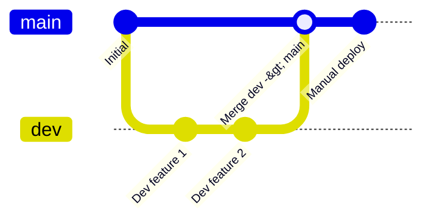

# War-News Operations Runbook: Deployment vs. Dev Stacks

This runbook documents how to run, manage, and isolate the **Deployment** and **Dev/Test** Docker Compose stacks side-by-side on the same Windows host without port or database conflicts.

---

## 1. Stack Overview & Port Mappings

Both stacks run concurrently on the same machine under separate Docker Compose project names, isolated internal bridge networks, independent named data volumes, and different host ports.

| Component | Deployment Stack (`main`) | Dev / Test Stack (`dev`) | Notes |
| :--- | :--- | :--- | :--- |
| **Git Branch** | `main` | `dev` (or feature branch off `dev`) | Developers branch off `dev`; merge `dev` -> `main` when verified |
| **Compose Project Name** | `war-news` (or `war_news_main`) | `war_news_dev` | Set via `COMPOSE_PROJECT_NAME` / `docker-compose.dev.yml` |
| **Compose Files Used** | `docker-compose.yml` | `docker-compose.yml`<br>`docker-compose.dev.yml` | Dev file re-enables live bind mounts (`.:/app`) for hot-reload |
| **Environment File** | `.env.main` (or `.env`) | `.env.dev` | Ignored by git; distinct ports & DB |
| **Postgres Database** | `war_news_dev` | `war_news_devtest` | **CRITICAL:** `war_news_dev` is live production data; never overwrite or drop |
| **Postgres Host Port** | **`5432`** | **`5434`** | Connect via host psql/DBeaver on these ports |
| **Backend API Port** | **`8000`** (`http://localhost:8000`) | **`8001`** (`http://localhost:8001`) | FastAPI / Uvicorn API endpoints & Swagger docs (`/docs`) |
| **Frontend UI Port** | **`5173`** (`http://localhost:5173`) | **`5174`** (`http://localhost:5174`) | Vite React Dashboard |
| **Redis Port** | Internal only (`6379`) | Internal only (`6379`) | Separated by Docker network bridge |
| **Bind Mounts** | **None** (pure built image runtime) | **Yes** (`.:/app`, `./frontend:/app`) | Prevents Windows host filesystem shadowing in production |

> [!IMPORTANT]
> **Known Frontend Architecture Note**:
> The frontend Dockerfile currently runs Vite in dev server mode (`npm run dev`). Because host bind mounts are removed on the deployment stack to prevent host-mount shadowing, the frontend runs against the source files copied into the image at build time (`COPY . .`). Rebuilding the image (`--build`) bakes fresh code into the deployment frontend. A future optimization can implement a multi-stage static build (`vite build` + static server/nginx).

---

## 2. Deployment Stack Operations (`main`)

The deployment stack is the live, production-facing system. It runs purely against built Docker images without live host-filesystem bind mounts.

### A. Pulling and Deploying Updates (Manual Deploy)

Open PowerShell and navigate to the repository:

```powershell
cd "C:\Users\User\Desktop\lebanon-news-monitor\War-news"

# 1. Ensure you are on main and up to date
git checkout main
git pull origin main

# 2. Build and start deployment stack in background
# (Using .env.main if dedicated deploy env is maintained, or .env)
docker compose -p war-news --env-file .env.main up -d --build

# 3. Verify services are running and healthy
docker compose -p war-news --env-file .env.main ps
```

### B. Checking Logs & Health

```powershell
# View logs of all deployment services
docker compose -p war-news --env-file .env.main logs -f

# Check backend health directly
curl http://localhost:8000/health
```

### C. Stopping the Deployment Stack

```powershell
docker compose -p war-news --env-file .env.main down
```

---

## 3. Dev / Test Stack Operations (`dev`)

The dev stack runs side-by-side with deployment for day-to-day development and integration testing.

### A. First-Time Setup: Database Creation & Migration

The dev stack points to `war_news_devtest`. The database must be initialized fresh without copying or altering production data.

1. **Start the database and redis containers first**:
   ```powershell
   docker compose -f docker-compose.yml -f docker-compose.dev.yml --env-file .env.dev up -d db redis
   ```

2. **Create the `war_news_devtest` database**:
   Connect via `docker compose exec` to create the database if it doesn't already exist:
   ```powershell
   docker compose -f docker-compose.yml -f docker-compose.dev.yml --env-file .env.dev exec db psql -U postgres -c "CREATE DATABASE war_news_devtest;"
   ```

3. **Enable pgvector and run Alembic migrations**:
   ```powershell
   # Enable vector extension
   docker compose -f docker-compose.yml -f docker-compose.dev.yml --env-file .env.dev exec db psql -U postgres -d war_news_devtest -c "CREATE EXTENSION IF NOT EXISTS vector;"

   # Run migrations from within the backend container (or a disposable container)
   docker compose -f docker-compose.yml -f docker-compose.dev.yml --env-file .env.dev run --rm backend alembic upgrade head
   ```

### B. Starting the Dev Stack

```powershell
cd "C:\Users\User\Desktop\lebanon-news-monitor\War-news"

# 1. Switch to dev branch
git checkout dev
git pull origin dev

# 2. Start dev stack with live hot-reload bind mounts
docker compose -f docker-compose.yml -f docker-compose.dev.yml --env-file .env.dev up -d --build

# 3. Verify status
docker compose -f docker-compose.yml -f docker-compose.dev.yml --env-file .env.dev ps
```

### C. Stopping the Dev Stack

```powershell
docker compose -f docker-compose.yml -f docker-compose.dev.yml --env-file .env.dev down
```

---

## 4. Git Workflow



1. **Daily Development**:
   - Work on `dev` or create feature branches off `dev` (`git checkout -b feature/xyz dev`).
   - Push and test changes on the dev stack (`http://localhost:8001` / `http://localhost:5174`).
   - Merge approved features into `dev`.

2. **Releasing to Production**:
   - Verify all tests and checks pass on `dev`.
   - Merge `dev` into `main`:
     ```powershell
     git checkout main
     git pull origin main
     git merge dev
     git push origin main
     ```
   - On the deployment server/directory, execute the deployment procedure from Section 2 (`git pull`, `docker compose up -d --build`).

---

## 5. Flagged System Follow-ups (For Tracking)

- **Red Alert Rule Rejections**: 190/190 recent messages are being rejected at the rule layer (`red_alert_air_violation_service.py`), predominantly (165/190) citing *"Location could not be identified reliably from the alert image"*. This indicates an OCR/vision extraction issue that requires dedicated investigation.
- **Frontend Multi-stage Production Image**: As noted, the frontend currently runs in Vite development server mode (`npm run dev`) inside the container. When convenient, a multi-stage Docker build producing a static bundle (`dist/`) served by nginx or `vite preview` should be implemented.

---

## 6. Ollama (LAN inference server) tuning

Ollama is **not** part of either compose stack; it runs standalone on the LAN
host behind `OLLAMA_BASE_URL`. Server-side and app-side knobs must be tuned
together, from measured numbers (`nvidia-smi`, `ollama ps` during a real
extraction, `ollama show qwen2.5:7b`), never guessed.

| Setting | Where | Default | Notes |
|---|---|---|---|
| `OLLAMA_NUM_PARALLEL` | Ollama host env | Ollama default | Concurrent requests per loaded model. Each slot needs its own KV cache (≈ `num_ctx` tokens), so on a 4 GB card raising it pushes layers to CPU. Keep ≥ the app's `TIER1_LLM_MAX_CONCURRENT_REQUESTS` + `TIER2_LLM_MAX_CONCURRENT_REQUESTS` for extraction, or requests just queue server-side. |
| `OLLAMA_MAX_LOADED_MODELS` | Ollama host env | Ollama default | qwen2.5:7b (extraction) and gpt-oss:20b (relevance) cannot both fit in 4 GB VRAM; expect model swaps unless relevance runs elsewhere. |
| `OLLAMA_NUM_CTX` | app `.env` | unset (server default) | Sent as `options.num_ctx`. Measured Tier 1 system prompt ≈ 4.5k tokens (single village) to ≈ 6.7k (multi-village) + post + JSON answer; 8192 is the smallest safe value. Too small = Ollama silently drops the start of the system prompt ("truncating input prompt" in its log). |
| `OLLAMA_KEEP_ALIVE` | app `.env` | unset (server default, 5m) | Sent as `keep_alive`, e.g. `30m` or `-1`, so the model is not unloaded between sweeps. |
| `TIER1_LLM_MAX_CONCURRENT_REQUESTS` / `TIER2_LLM_MAX_CONCURRENT_REQUESTS` / `OLLAMA_MAX_CONCURRENT_REQUESTS` | app `.env` | 2 / 2 / 4 | Placeholders until the Phase 0 latency numbers are in. |
